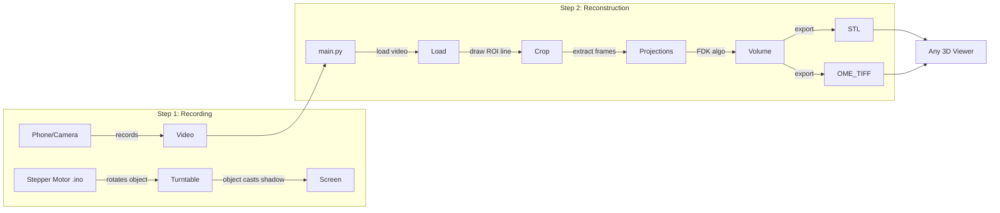

# Shadow CT Reconstruction

A pipeline that reconstructs 3D objects from their shadows at all angles. Records video of a rotating object against a backlight, extracts projection frames, and performs FDK (Feldkamp-Davis-Kress) reconstruction using TIGRE. Exports OME-TIFF and STL for viewing in any 3D viewer.

## Features

- **GUI video cropper** – Interactive tool to define the region of interest (ROI) by drawing a horizontal line
- **Projection extraction** – Converts video frames to log-inverted projection data
- **FDK reconstruction** – GPU-accelerated cone-beam CT reconstruction via TIGRE
- **Multiple export formats** – OME-TIFF, NumPy, STL (3D printable mesh)

## Prerequisites

- Python 3.9+
- CUDA 11.8 (for TIGRE GPU acceleration)
- NVIDIA GPU

## Installation

> **TIGRE installation:** `pip install tigre` may not work reliably. Install TIGRE first using the official instructions:
>
> https://github.com/CERN/TIGRE/blob/master/Frontispiece/python_installation.md
>
> Then run `pip install -r requirements.txt` for the remaining dependencies.

```bash
pip install -r requirements.txt
```

## Usage

1. Run the application: `python main.py`
2. Click **Load Video** and select a `.mov` file
3. Draw a horizontal line across the object to define the square ROI
4. Click **Crop and Process**
5. The pipeline will crop the video, extract projections, run FDK reconstruction, and save outputs to a timestamped folder in `final_config/`

## How the Code Works

This project reconstructs 3D objects from their **shadows at all angles**—a form of computed tomography where each video frame is a 2D projection (shadow), and many projections are combined to recover the 3D volume.



### Two-File Workflow

**Step 1 – Recording** ([`Stepper_motor_code_copy_20250623123934.ino`](Stepper_motor_code_copy_20250623123934.ino))

- Upload the Arduino sketch before recording
- The stepper rotates the turntable at a constant rate (delay formula: `(10*k)/(32*f)` with `k=400`, `f=30`)
- Record video with a phone or camera while the object rotates against a backlight
- Each frame captures the shadow from a different angle
- **Setup:** Arduino + stepper driver wired to pins 2 and 3

**Step 2 – Reconstruction** ([`main.py`](main.py))

1. Run `python main.py`
2. Load the recorded `.mov` file
3. Draw a horizontal line to define the square ROI
4. Click **Crop and Process**
5. Open `model/model.stl` or `model/reconstructed_volume.ome.tiff` in any 3D viewer

**Internal flow** (in order): [`main.py`](main.py) → `VideoCropper` GUI, then `process_video()` → [`video_processor.py`](video_processor.py) (grayscale, rotate 90°, resize, log inversion) → [`geometry_config.py`](geometry_config.py) (TIGRE geometry and angles) → [`reconstruction.py`](reconstruction.py) (FDK → `.npy`, slices, `model.stl`) → OME-TIFF via `numpy2ometiff`

**Outputs** (in `final_config/<run_folder>/`): `model/model.stl`, `model/reconstructed_volume.ome.tiff`, `middle_slices.png`, `first_frame_comparison.png`, `config.txt`

> **Note:** [`cropper.py`](cropper.py) is a standalone cropper that only saves cropped video to `cropped_video_data/` and does **not** run reconstruction. The main entry point is [`main.py`](main.py), which includes both cropping and reconstruction.

## Configuration

All parameters are defined in [`config.py`](config.py):

| Section | Key parameters |
|---------|----------------|
| **Reconstruction** | `filter_type` (ram_lak, shepp_logan, hamming, etc.), `stl_threshold`, `apply_circular_mask` |
| **Geometry** | `image_size`, `detector_size`, `DSD`, `DSO`, `pixel_size` |
| **Video** | `num_frames`, `target_size` |
| **Physical** | `pixel_size_x`, `pixel_size_y`, `physical_size_z`, `unit` |

## Project Structure

| File | Description |
|------|-------------|
| `main.py` | Entry point; GUI cropper and reconstruction pipeline orchestration |
| `config.py` | All configuration parameters |
| `reconstruction.py` | FDK reconstruction, visualization slices, STL export |
| `video_processor.py` | Video frame extraction and projection preprocessing |
| `geometry_config.py` | TIGRE geometry and projection angles |
| `cropper.py` | Standalone video cropper (alternative to main.py cropper) |

## Output

For each run, a timestamped directory is created in `final_config/` containing:

- `reconstructed_volume.ome.tiff` – OME-TIFF volume (in `model/`)
- `model.stl` – 3D mesh for printing
- `middle_slices.png` – YZ, XZ, XY slice visualizations
- `first_frame_comparison.png` – Original vs processed frame
- `config.txt` – Full parameter record
